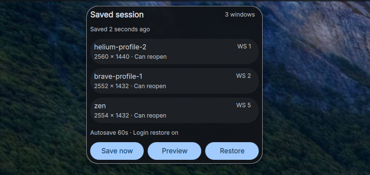

# DankSession

Application session restoration for [DankMaterialShell](https://github.com/AvengeMedia/DankMaterialShell). DankSession remembers open windows, workspaces, outputs, scrolling-column widths, focused windows, and floating geometry. A single Go binary provides the continuously running backend and the command-line interface used by the DMS widget.



## Installation

DankSession supports Hyprland. It requires DankMaterialShell, `hyprctl`, and the
`danksession` Go backend. Relaunching applications also requires systemd 254 or
newer. Scrolling size restoration targets Hyprland's Lua-based scrolling layout;
other compositors are not supported yet.

Installing the DMS widget alone does not install or start the backend. Configure
explicit [application rules](#application-rules), start the background service,
and use **Preview** before enabling **Restore after login** in plugin settings.
Automatic saving is enabled by default; automatic restoration is opt-in.

### Nix / Home Manager

Add the release as a flake input:

```nix
inputs.danksession.url = "github:alcxyz/DankSession/v0.3.5";
```

In your Home Manager configuration (with `inputs` available):

```nix
{ inputs, pkgs, ... }: {
  imports = [ inputs.danksession.homeManagerModules.default ];

  services.dankSession = {
    enable = true;
    package = inputs.danksession.packages.${pkgs.stdenv.hostPlatform.system}.default;
    autoStart = true;
  };

  # Uses the Home Manager module supplied by DankMaterialShell.
  programs.dank-material-shell.plugins.dankSession = {
    enable = true;
    src = inputs.danksession.outPath;
  };
}
```

The service starts with the next graphical session. The module's `autoStart`
default remains `false` so installing it does not silently enable restoration.
Enable the plugin and add its widget to your DMS bar as needed.

### Manual installation

Build the backend from the same release as the widget (Go 1.24 or newer):

```sh
git clone --branch v0.3.5 https://github.com/alcxyz/DankSession.git
cd DankSession
go build -ldflags '-X main.version=0.3.5' -o danksession ./cmd/danksession
install -Dm755 danksession "$HOME/.local/bin/danksession"
mkdir -p "$HOME/.config/DankMaterialShell/plugins/DankSession"
cp plugin.json SessionWidget.qml SessionSettings.qml ExclusionEditor.qml \
  "$HOME/.config/DankMaterialShell/plugins/DankSession/"
```

Ensure `~/.local/bin` is in DMS's `PATH`. Enable DankSession in DMS plugin settings
and add it to your bar. Registry installation supplies the widget files; the
backend and service still need to be installed separately.

Create `~/.config/systemd/user/danksession.service`:

```ini
[Unit]
Description=Capture and restore the DankSession desktop state
PartOf=graphical-session.target
After=graphical-session.target

[Service]
ExecStart=%h/.local/bin/danksession daemon
Restart=on-failure
RestartSec=2

[Install]
WantedBy=graphical-session.target
```

Then run `systemctl --user daemon-reload` and
`systemctl --user enable --now danksession.service`. Your graphical session must
activate `graphical-session.target` and provide Hyprland's environment to the
systemd user manager. Check `danksession status` for `daemonRunning: true`.

## Commands

| Command | Description |
|---|---|
| `danksession capture` | Atomically save the current desktop |
| `danksession status` | Print snapshot status as JSON |
| `danksession restore --dry-run` | Preview matching, launches, and placement |
| `danksession restore` | Restore configured applications and window placement |
| `danksession configure` | Update backend preferences while retaining application rules |
| `danksession exclusions list` | List exclusion rules and currently open application identifiers |
| `danksession exclusions preview` | Read a JSON matcher from stdin and preview matching open windows |
| `danksession exclusions update` | Read a revision-checked exclusion edit from stdin |
| `danksession daemon` | Capture window events and optionally restore after login |

The default state path is `~/.local/state/danksession/last.json`. Files are written atomically with mode `0600`. Window titles are excluded unless explicitly enabled.

At the first daemon start in each compositor session, the incoming snapshot is retained as `last.json.previous`. Automatic restoration is attempted only once per compositor session; restarting the daemon does not repeat it. Shutdown retains the last completed capture. Capture and restore commands are mutually exclusive, including commands started by the widget while the daemon is running.

The widget shows whether the capture daemon is running and provides a **Preview** action that does not move or launch windows. Enabling “Restore after login” sets a backend preference; enable `services.dankSession.autoStart` separately to start the daemon at graphical login.

The bar shows only the session icon: accented while automatic saving is running,
muted while paused or stopped, and red on errors. Click it for window counts,
the last save time, and Save now, Restore, and Preview actions.

The popout lists the actual saved snapshot, not currently open windows: each row
shows the application identifier, workspace, saved dimensions, and whether it can
reopen, needs an already-running window (placement only), or is skipped by current
rules. This is not a guarantee of successful restoration; Preview checks the live
desktop. The panel fits short lists and scrolls longer ones. This summary never
includes window titles or launch commands, even when title capture is enabled.

In plugin settings, **Automatic saving** pauses or resumes background capture without stopping the daemon. **Save frequency** controls periodic safety saves (5–120 seconds, default 15); desktop events can save sooner. Preference changes are picked up by the running daemon without a restart. Manual **Save now** remains available while automatic saving is paused. A stopped-service warning explains when automatic saving and login restoration are unavailable.

### Application exclusions

Use **Add manually** for an exact application identifier, or select an application from the searchable **Currently open applications** list. Selection uses the initial application class (falling back to its current class), not a changing title. Preview shows matching application identifiers, window counts, and workspaces before confirmation, without exposing window titles. Rules can be edited, disabled/enabled, or removed with confirmation.

Advanced fields accept Go regular expressions; all nonempty fields must match. Exclusions prevent capture, relaunch, and repositioning, including restoration from older snapshots. Editing a rule does not change the desktop or overwrite the saved snapshot. Stale edits are rejected and refreshed so another edit cannot redirect a rule index.

Title rules are conservative: snapshots saved without titles skip every application matching the rule's class fields; a title-only rule skips all windows whose saved title is unknown. An excluded open window is never treated as a reason to relaunch its application. Leave title empty for ordinary application exclusions.

Restore closes the popout before changing the desktop so it cannot hold keyboard focus away from Hyprland's layout commands. Reopen the widget to inspect the result.

After updating an installed plugin without restarting DMS, rescan it if its manifest changed, then run `dms ipc call plugins reload dankSession` **last**. Reload busts the QML component cache; disabling and enabling alone can leave an older widget running.

## Application rules

DankSession never derives launch commands from `/proc` or saved process command lines. Applications must opt into relaunching through `~/.config/danksession/config.json`:

```json
{
  "autoCapture": true,
  "autoRestore": false,
  "captureUnconfigured": true,
  "captureTitles": false,
  "debounceMs": 750,
  "captureIntervalSeconds": 15,
  "restoreTimeoutSeconds": 20,
  "applications": [
    {
      "id": "browser",
      "command": ["my-browser"],
      "match": {"initialClass": "^my-browser$"}
    },
    {
      "id": "mail",
      "command": ["my-mail-client"],
      "match": {"initialClass": "^my-mail-client$"}
    }
  ],
  "exclude": [
    {"class": "^(pinentry|polkit-.*)$"}
  ]
}
```

Unconfigured windows may have their running instance repositioned, but DankSession cannot relaunch them. Scratchpad-tagged and special-workspace windows are excluded automatically.

Restoration applies current exclusions to older snapshots, skips disconnected outputs, and uses scrolling layout commands only on scrolling workspaces. Named workspaces and scaled/rotated output widths are supported. A failed staging operation attempts to return every staged window and restores the prior focus; recovery failures are reported.

Relaunched applications run in independent systemd user services so stopping DMS or the capture daemon does not terminate them. This requires `systemd-run` (systemd 254 or newer); the Nix package supplies it. Launch arguments are passed literally, and only explicitly configured application commands are started.

## Restore limitations

Scrolling column widths are read directly from Hyprland's Lua layout state, including custom mouse-resized widths. Geometry-based width estimation remains a fallback when a window has no available layout state; centering is still inferred from visible geometry. Stacked row heights are restored through Hyprland's tiled resize API, subject to application minimum sizes and available output space. Workspaces containing unsaved tiled windows are not reconstructed. Non-scrolling tiled layouts do not yet support size restoration. Multi-window matching uses application identity and optional titles; the application is responsible for reopening its own documents/tabs. A successful unit test suite is not a substitute for testing a complete logout/login restore on the target compositor. Keep automatic restoration disabled until that test passes.

## Design

- **One plugin repository** — QML, Go backend, schema, Nix package, and Home Manager module are released together.
- **Long-running Go backend** — the service captures event-driven and periodic snapshots and survives DMS UI restarts.
- **GitHub-first** — GitHub is canonical for branches, pull requests, CI, and releases.
- **Safe launches** — only explicit argument arrays are executed; raw process command lines are never persisted.
- **Private local state** — snapshots never belong in a configuration repository.
- **Hyprland adapter first** — compositor integration is isolated so another adapter can be added later.

See [docs/adr](docs/adr/) for the decisions behind these boundaries.

## Development

Every user-facing QA deployment must have a new `plugin.json` version: increment
the patch for fixes and the minor for new features. Do not reuse a version for
changed code deployed to QA. The manifest is the version source for both the DMS
label and the Nix-built backend (`danksession --version`). Keep a short entry in
`CHANGELOG.md` for each iteration; version bumps on `dev` do not publish releases.

```sh
go test ./...
go build ./cmd/danksession
bash test.sh
nix build
```

`QT_QPA_PLATFORM=offscreen quickshell -p tests/qml --no-duplicate` runs isolated popout layout checks with
lightweight visual stubs, without loading DMS services or touching saved sessions.
Expect `POPOUT QA PASSED`; also check the installed popout in DMS during UI QA.

For an opt-in live scrolling-width and stacked-height test, run
`DANKSESSION_LIVE_TEST=1 go test ./internal/session -run TestLiveScrollingSizeRestore -v`.
It briefly focuses disposable `foot` windows on an unused workspace and restores
the previous focus afterward. It uses temporary snapshots, never the user's saved session.

## License

MIT
